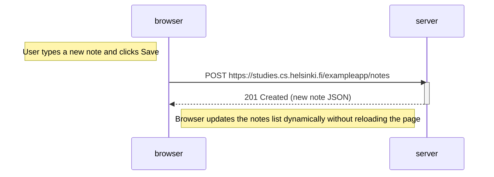

```mermaid
sequenceDiagram
    participant browser
    participant server

    Note left of browser: User types a new note and clicks Save

    browser->>server: POST https://studies.cs.helsinki.fi/exampleapp/notes
    activate server
    server-->>browser: 201 Created (new note JSON)
    deactivate server

    Note right of browser: Browser updates the notes list dynamically without reloading the page
```
